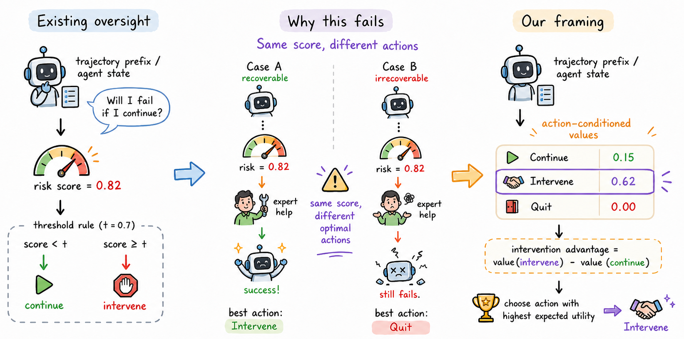

# Calibration Is Not Control: Intervention Value for LLM-Agent Oversight

*Chubin Zhang<sup>1</sup>,
Zhenglin Wan<sup>2</sup>,
Xingrui Yu<sup>3,4,‡</sup>,
Jingxuan Wu<sup>5</sup>,
Qi Wen<sup>2</sup>,
Pengfei Zhou<sup>2</sup>,
Wangbo Zhao<sup>2</sup>,
Ivor Tsang<sup>1,3,4</sup>*

<sup>1</sup>Nanyang Technological University, Singapore &nbsp; <sup>2</sup>National University of Singapore, Singapore
<sup>3</sup>CFAR, A\*STAR, Singapore &nbsp; <sup>4</sup>IHPC, A\*STAR, Singapore &nbsp; <sup>5</sup>UNC-Chapel Hill, United States

(<sup>‡</sup>: Corresponding author)

<p align="center">
  <a href="https://arxiv.org/abs/2606.21399">
    </a>
  &nbsp;
  
  &nbsp;
  <a href="https://github.com/bennidict23/calibration-is-not-control">
    </a>
  &nbsp;
  
</p>

**Calibration Is Not Control** shows that a calibrated failure score is not enough to decide when an LLM agent should be stopped or handed off: states with the same failure risk can call for different actions, and the decision depends on what the intervention would achieve.

## 🧠 Overview

<p align="center">
    
</p>

We replay an agent to a decision prefix and execute every available action from that same state: continue, intervene, or quit. The branch outcomes supervise controllers that see only the prefix, which are compared with failure-triggered routing on held-out prefixes.

## 📂 Directory Structure

```
.
├── scripts/
│   ├── collect_alfworld_branches.py   - Collect branched ALFWorld prefixes
│   └── evaluate_controllers.py        - Compare failure-triggered routing and action-conditioned controllers
│
└── src/oversight_branching/
    ├── alfworld_text.py               - ALFWorld environment interface
    ├── local_llm.py                   - LLM client (OpenAI-compatible endpoint or local vLLM)
    └── policy_learning.py             - Controller learning and evaluation
```

## 🛠️ Installation

```bash
git clone https://github.com/bennidict23/calibration-is-not-control.git
cd calibration-is-not-control

conda create -n cinc python=3.10
conda activate cinc
pip install -r requirements.txt
alfworld-download
```

## 🚀 Usage

Serve the base agent with an OpenAI-compatible endpoint:

```bash
vllm serve Qwen/Qwen2.5-7B-Instruct --port 8000
```

Collect branched prefixes:

```bash
PYTHONPATH=src python scripts/collect_alfworld_branches.py \
  --api-base http://127.0.0.1:8000 --api-model Qwen/Qwen2.5-7B-Instruct \
  --intervention-mode expert_defer --max-episode-steps 20 \
  --train-games 8 --val-games 4 --test-games 8 --prefixes-per-game 2 \
  --seed 13 --output-dir runs/alfworld_qwen7b_seed13
```

Evaluate the controllers:

```bash
PYTHONPATH=src python scripts/evaluate_controllers.py runs/alfworld_* --output-json results/controllers.json
```

## 📝 Citation

```bibtex
@inproceedings{zhang2026calibration,
  title     = {Calibration Is Not Control: Intervention Value for {LLM}-Agent Oversight},
  author    = {Zhang, Chubin and Wan, Zhenglin and Yu, Xingrui and Wu, Jingxuan and Wen, Qi and Zhou, Pengfei and Zhao, Wangbo and Tsang, Ivor},
  booktitle = {Advances in Neural Information Processing Systems},
  year      = {2026}
}
```

## 📄 License

This project is released under the MIT License.
